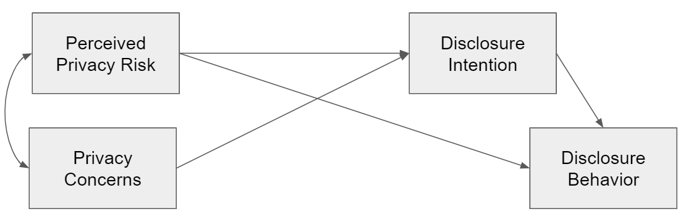
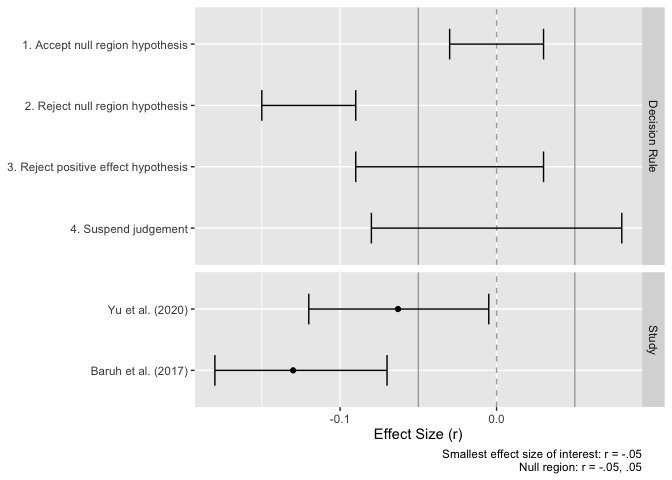

Comment on Yu et al. (2020)
================

  - [Set-up](#set-up)
  - [Reported Model](#reported-model)
  - [Saturated Model](#saturated-model)
  - [Support for Null Hypothesis](#support-for-null-hypothesis)
      - [Confidence Intervals](#confidence-intervals)
      - [Bayes Factors](#bayes-factors)
  - [Literature](#literature)

In what follows, we reanalyze the study by Yu et al. (2020).

# Set-up

``` r
options(width = 130) # set output pagewidth
set.seed (190819)  # set seed 
library(bain); library(lavaan); library(tidyverse)  # load packages
```

We first load the covariance matrix reported by Yu et al. (2020).

``` r
cor_ma <- read.csv("data_cor.csv", row.names = 1)
cor_ma <- as.matrix(cor_ma)
cor_ma
```

    ##         pri_ris pri_con dis_int dis_beh
    ## pri_ris   1.000   0.620  -0.203  -0.165
    ## pri_con   0.620   1.000  -0.159  -0.063
    ## dis_int  -0.203  -0.159   1.000   0.487
    ## dis_beh  -0.165  -0.063   0.487   1.000

We then compute the harmonic mean given the sample sizes reported in the
paper.

``` r
n_c <- read.csv("data_n.csv", row.names = 1)
n_hm <- psych::harmonic.mean(n_c)
n_hm
```

    ##        n 
    ## 8345.094

# Reported Model

Referring to Problem 2, we rebuild the model reported in the paper.



``` r
model_reported <- "
  pri_con ~~ pri_ris
  dis_int ~ pri_con + pri_ris
  dis_beh ~ pri_ris + dis_int
"
fit_reported <- sem(model_reported, sample.cov = cor_ma, sample.nobs = n_hm)
```

The model shows the following fit:

``` r
fit_indices <- c("chisq", "df", "pvalue", "cfi", "nfi", "rmsea", "srmr")
fitMeasures(fit_reported, fit_indices)
```

    ##  chisq     df pvalue    cfi    nfi  rmsea   srmr 
    ## 54.307  1.000  0.000  0.992  0.992  0.080  0.017

The results equal those reported in the paper (with the exception that
in the paper RMSEA is falsely reported as .008).

Note that there is one degree of freedom, because the path `pri_con` on
`dis_beh` is not included.

We then look at the results of the structural model.

``` r
summary(fit_reported, standardized = TRUE, header = FALSE)
```

    ## 
    ## Parameter Estimates:
    ## 
    ##   Standard errors                             Standard
    ##   Information                                 Expected
    ##   Information saturated (h1) model          Structured
    ## 
    ## Regressions:
    ##                    Estimate  Std.Err  z-value  P(>|z|)   Std.lv  Std.all
    ##   dis_int ~                                                             
    ##     pri_con          -0.054    0.014   -3.944    0.000   -0.054   -0.054
    ##     pri_ris          -0.170    0.014  -12.428    0.000   -0.170   -0.170
    ##   dis_beh ~                                                             
    ##     pri_ris          -0.069    0.010   -7.086    0.000   -0.069   -0.069
    ##     dis_int           0.473    0.010   48.587    0.000    0.473    0.473
    ## 
    ## Covariances:
    ##                    Estimate  Std.Err  z-value  P(>|z|)   Std.lv  Std.all
    ##   pri_con ~~                                                            
    ##     pri_ris           0.620    0.013   48.136    0.000    0.620    0.620
    ## 
    ## Variances:
    ##                    Estimate  Std.Err  z-value  P(>|z|)   Std.lv  Std.all
    ##    .dis_int           0.957    0.015   64.595    0.000    0.957    0.957
    ##    .dis_beh           0.758    0.012   64.595    0.000    0.758    0.758
    ##     pri_con           1.000    0.015   64.595    0.000    1.000    1.000
    ##     pri_ris           1.000    0.015   64.595    0.000    1.000    1.000

The results resemble exactly those reported in the paper.

# Saturated Model

We now estimate the saturated model by adding `pri_con` as predictor for
`dis_beh`.


``` r
model_saturated <- "
  pri_con ~~ pri_ris
  dis_int ~ pri_con + pri_ris
  dis_beh ~ pri_con + pri_ris + dis_int
"
fit_saturated <- sem(model_saturated, sample.cov = cor_ma, sample.nobs = n_hm)
```

The model shows the following fit:

``` r
fitMeasures(fit_saturated, fit_indices)
```

    ##  chisq     df pvalue    cfi    nfi  rmsea   srmr 
    ##      0      0     NA      1      1      0      0

Because the model is satured and we have no degrees of freedom, we now
get “perfect” fit.

**The RMSEA equals 0, and not .368 as reported in the paper.**

We then look at the results of the structural model.

``` r
summary(fit_saturated, standardized = TRUE, header = FALSE, ci = TRUE)
```

    ## 
    ## Parameter Estimates:
    ## 
    ##   Standard errors                             Standard
    ##   Information                                 Expected
    ##   Information saturated (h1) model          Structured
    ## 
    ## Regressions:
    ##                    Estimate  Std.Err  z-value  P(>|z|) ci.lower ci.upper   Std.lv  Std.all
    ##   dis_int ~                                                                               
    ##     pri_con          -0.054    0.014   -3.944    0.000   -0.081   -0.027   -0.054   -0.054
    ##     pri_ris          -0.170    0.014  -12.428    0.000   -0.196   -0.143   -0.170   -0.170
    ##   dis_beh ~                                                                               
    ##     pri_con           0.089    0.012    7.381    0.000    0.066    0.113    0.089    0.089
    ##     pri_ris          -0.124    0.012  -10.132    0.000   -0.148   -0.100   -0.124   -0.124
    ##     dis_int           0.476    0.010   49.019    0.000    0.457    0.495    0.476    0.476
    ## 
    ## Covariances:
    ##                    Estimate  Std.Err  z-value  P(>|z|) ci.lower ci.upper   Std.lv  Std.all
    ##   pri_con ~~                                                                              
    ##     pri_ris           0.620    0.013   48.136    0.000    0.595    0.645    0.620    0.620
    ## 
    ## Variances:
    ##                    Estimate  Std.Err  z-value  P(>|z|) ci.lower ci.upper   Std.lv  Std.all
    ##    .dis_int           0.957    0.015   64.595    0.000    0.928    0.986    0.957    0.957
    ##    .dis_beh           0.753    0.012   64.595    0.000    0.730    0.776    0.753    0.753
    ##     pri_con           1.000    0.015   64.595    0.000    0.970    1.030    1.000    1.000
    ##     pri_ris           1.000    0.015   64.595    0.000    0.970    1.030    1.000    1.000

Interestingly, we even find a *positive* relation between privacy
concerns and disclosure behavior.

However, this finding shouldn’t be surprising: Because privacy concern
and privacy risks are strongly correlated (*r* = 0.62), we have a
situation typical of *multicollinearity.* That is, if strongly
correlated predictors are included in the same model, confidence
intervals increase, and oftentimes signs reverse (as is the case here).

This isn’t even necessary problematic, but reflects are more difficult
to interpret model and less statistical power (see Vanhove 2019).

# Support for Null Hypothesis

## Confidence Intervals

We first design a figure to illustrate how confidence intervals can be
used to test support for the null hypothesis.

``` r
# make table with data
d_plot <- tribble(
  ~name, ~type, ~Effect, ~ll, ~ul,
  "1. Accept null region hypothesis", "Decision Rule", NA, -.03, .03, 
  "2. Reject null region hypothesis", "Decision Rule", NA, -.15, -.09,
  "3. Reject positive effect hypothesis", "Decision Rule", NA, -.09, .03,
  "4. Suspend judgement", "Decision Rule", NA, -.08, .08,
  "Yu et al. (2020)", "Study", -.063, -.120, -.005,
  "Baruh et al. (2017)", "Study", -.13, -.18, -.07
) %>% 
  mutate(
    name = factor(name, levels = name),
    name = fct_rev(name),
    type = factor(type, levels = c("Decision Rule", "Study"))
         )

# design plot
plot <- ggplot(d_plot, aes(y = name)) +
  geom_vline(xintercept = 0, color = "darkgrey", linetype = "dashed") + 
  geom_vline(xintercept = -.05, color = "darkgrey") +
  geom_vline(xintercept = .05, color = "darkgrey") +
  geom_point(aes(Effect)) +
  geom_errorbarh(aes(xmin = ll, xmax = ul), height = .5) +
  facet_grid(rows = vars(type), scales = "free_y", space = "free") +
  theme(axis.title.y = element_blank())+
  labs(x = "Effect Size (r)",
       caption = "Smallest effect size of interest: r = -.05
                  Null region: r = -.05, .05")

ggsave("figures/figure_intervals.png", height = 3.5)
plot
```

<!-- -->

## Bayes Factors

We now compare the likelihood of competing hypotheses using Bayes
factors.

### Dienes’ Bayes Factor

``` r
source("fun_bayes_factor.R")  # load bayes factor function

# insert values from Yu et al. (2020)
sample_z <- -2.122
sample_r <- -.063
sample_se <- sample_r / sample_z  # see Dienes (2014, p. 6)
sample_r_ll <- sample_r - 1.96 * sample_se 
sample_r_ul <- sample_r + 1.96 * sample_se
sample_k <- 44
sample_sd <- sample_se * sqrt(sample_k)
```

We hypothesize that there is a small relation between concerns and
information sharing. We compare the likelihood of this hypothesis, hence
our theory, to the null hypothesis, in light of our data.

``` r
Bf(se = sample_se, # note that this is an error in the script and should be "se" (instead of "sd"); if we insert se instead of sd, we obtain the exact same results as Dienes' online calculator at www.lifesci.sussex.ac.uk/home/Zoltan_Dienes/inference/bayes_factor.swf
   obtained = sample_r,
   uniform = 0,
   meanoftheory = -.1,
   sdtheory = .05,  # SD = M/2; see Dines (2014, p. 6)
   tail = 2)
```

    ## $LikelihoodTheory
    ## [1] 5.603325
    ## 
    ## $Likelihoodnull
    ## [1] 1.41425
    ## 
    ## $BayesFactor
    ## [1] 3.962048

The results show that our theory is about 4 times more likely than the
null-hypothesis. This provides moderate support for our theory and
speaks against the null hypothesis.

To test whether our formula is correct, we have entered the same
information in Dienes’ [Bayes Factor
Calculator](%22www.lifesci.sussex.ac.uk/home/Zoltan_Dienes/inference/bayes_factor.swf%22).


The results are exactly the same, which shows that our function is
correct.

### Van Lissa’s BAIN

We can also compute the Bayes factor for informed hypotheses using Van
Lessa’s BAIN package.

In what follows, we compare H1: *r* \< -.05 (no privacy paradox) with
its complement H2: *r* ≥ -.05 (privacy paradox).

``` r
model_bf <- "
  dis_beh ~ pri_con
"
fit_bf <- sem(model_bf, sample.cov = cor_ma, sample.nobs = n_hm)

hypothesis_1 <- "
  dis_beh~pri_con < -.05;
"
bain(fit_bf, hypothesis_1)
```

    ## Bayesian informative hypothesis testing for an object of class lavaan:
    ## 
    ##    Fit   Com   BF.u  BF.c  PMPa  PMPb 
    ## H1 0.883 0.500 1.766 7.544 1.000 0.638
    ## Hu                               0.362
    ## 
    ## Hypotheses:
    ##   H1: dis_beh~pri_con<-.05
    ## 
    ## Note: BF.u denotes the Bayes factor of the hypothesis at hand versus the unconstrained hypothesis Hu. BF.c denotes the Bayes factor of the hypothesis at hand versus its complement.

H1 (no privacy paradox) is more than 7-times more likely than the H2
(privacy paradox) (see “BF.c”).

# Literature

<div id="refs" class="references">

<div id="ref-vanhoveCollinearityIsnDisease2019">

Vanhove, Jan. 2019. “Collinearity Isn’t a Disease That Needs Curing.”
<https://doi.org/https://osf.io/8x4uc/>.

</div>

<div id="ref-yuMetaanalysisExplorePrivacy2020">

Yu, Lu, He Li, Wu He, Feng-Kwei Wang, and Shiqiao Jiao. 2020. “A
Meta-Analysis to Explore Privacy Cognition and Information Disclosure of
Internet Users.” *International Journal of Information Management* 51
(April): 102015. <https://doi.org/10.1016/j.ijinfomgt.2019.09.011>.

</div>

</div>
