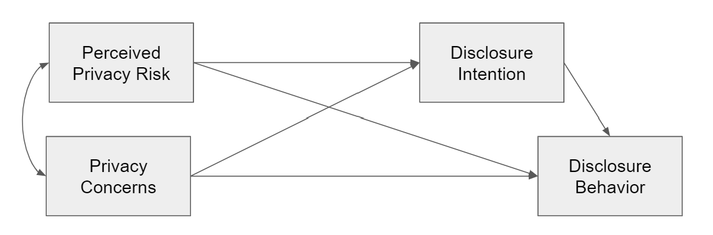

Response to Yu et al. (2020)
================

  - [Set-up](#set-up)
  - [Reported Model](#reported-model)
  - [Saturated Model](#saturated-model)

In what follows, we reanalyze the study by Yu et al. (2020).

# Set-up

We first recreate the covariance matrix reported by Yu et al. (2020).

``` r
options(width = 130) # 
vars <- c("pri_ris", "pri_con", "dis_int", "dis_beh")
cor_c <- c(1, .62, -.203, -.165, 1, -.159, -.063, 1, .487, 1)
cor_ma <- lavaan::lav_matrix_vech_reverse(cor_c, diagonal = TRUE)
colnames(cor_ma) <- vars
rownames(cor_ma) <- vars
cor_ma
```

    ##         pri_ris pri_con dis_int dis_beh
    ## pri_ris   1.000   0.620  -0.203  -0.165
    ## pri_con   0.620   1.000  -0.159  -0.063
    ## dis_int  -0.203  -0.159   1.000   0.487
    ## dis_beh  -0.165  -0.063   0.487   1.000

We then compute the harmonic mean given the sample sizes reported in the
paper.

``` r
n_c <- c(9611, 5152, 19062, 20013, 8229, 5079) # harmonic mean for n
n_hm <- psych::harmonic.mean(n_c)
n_hm
```

    ## [1] 8345.094

# Reported Model

Referring to Problem 2, we rebuild the model reported in the paper.


``` r
model_reported <- "
  pri_con ~~ pri_ris
  dis_int ~ pri_con + pri_ris
  dis_beh ~ pri_ris + dis_int
"
fit_reported <- lavaan::sem(model_reported, sample.cov = cor_ma, sample.nobs = n_hm)
```

The model shows the following fit:

``` r
fit_indices <- c("chisq", "df", "pvalue", "cfi", "nfi", "rmsea", "srmr")
lavaan::fitMeasures(fit_reported, fit_indices)
```

    ##  chisq     df pvalue    cfi    nfi  rmsea   srmr 
    ## 54.307  1.000  0.000  0.992  0.992  0.080  0.017

The results equal those reported in the paper (with the exception that
in the paper RMSEA is falsely reported as .008).

Note that there is one degree of freedom, because the path `pri_con` on
`dis_beh` is not included.

We then look at the results of the structural model.

``` r
lavaan::summary(fit_reported, standardized = TRUE, header = FALSE)
```

    ## 
    ## Parameter Estimates:
    ## 
    ##   Information                                 Expected
    ##   Information saturated (h1) model          Structured
    ##   Standard errors                             Standard
    ## 
    ## Regressions:
    ##                    Estimate  Std.Err  z-value  P(>|z|)   Std.lv  Std.all
    ##   dis_int ~                                                             
    ##     pri_con          -0.054    0.014   -3.944    0.000   -0.054   -0.054
    ##     pri_ris          -0.170    0.014  -12.428    0.000   -0.170   -0.170
    ##   dis_beh ~                                                             
    ##     pri_ris          -0.069    0.010   -7.086    0.000   -0.069   -0.069
    ##     dis_int           0.473    0.010   48.587    0.000    0.473    0.473
    ## 
    ## Covariances:
    ##                    Estimate  Std.Err  z-value  P(>|z|)   Std.lv  Std.all
    ##   pri_con ~~                                                            
    ##     pri_ris           0.620    0.013   48.136    0.000    0.620    0.620
    ## 
    ## Variances:
    ##                    Estimate  Std.Err  z-value  P(>|z|)   Std.lv  Std.all
    ##    .dis_int           0.957    0.015   64.595    0.000    0.957    0.957
    ##    .dis_beh           0.758    0.012   64.595    0.000    0.758    0.758
    ##     pri_con           1.000    0.015   64.595    0.000    1.000    1.000
    ##     pri_ris           1.000    0.015   64.595    0.000    1.000    1.000

The results resemble exactly those reported in the paper.

# Saturated Model

We now estimate the saturated model by adding `pri_con` as predictor for
`dis_beh`.



``` r
model_saturated <- "
  pri_con ~~ pri_ris
  dis_int ~ pri_con + pri_ris
  dis_beh ~ pri_con + pri_ris + dis_int
"
fit_saturated <- lavaan::sem(model_saturated, sample.cov = cor_ma, sample.nobs = n_hm)
```

The model shows the following fit:

``` r
lavaan::fitMeasures(fit_saturated, fit_indices)
```

    ##  chisq     df pvalue    cfi    nfi  rmsea   srmr 
    ##      0      0     NA      1      1      0      0

Because the model is satured and we have no degrees of freedom, we now
get “perfect” fit. The RMSEA equals 0, and not .368 as reported in the
paper.

We then look at the results of the structural model.

``` r
lavaan::summary(fit_saturated, standardized = TRUE, header = FALSE, ci = TRUE)
```

    ## 
    ## Parameter Estimates:
    ## 
    ##   Information                                 Expected
    ##   Information saturated (h1) model          Structured
    ##   Standard errors                             Standard
    ## 
    ## Regressions:
    ##                    Estimate  Std.Err  z-value  P(>|z|) ci.lower ci.upper   Std.lv  Std.all
    ##   dis_int ~                                                                               
    ##     pri_con          -0.054    0.014   -3.944    0.000   -0.081   -0.027   -0.054   -0.054
    ##     pri_ris          -0.170    0.014  -12.428    0.000   -0.196   -0.143   -0.170   -0.170
    ##   dis_beh ~                                                                               
    ##     pri_con           0.089    0.012    7.381    0.000    0.066    0.113    0.089    0.089
    ##     pri_ris          -0.124    0.012  -10.132    0.000   -0.148   -0.100   -0.124   -0.124
    ##     dis_int           0.476    0.010   49.019    0.000    0.457    0.495    0.476    0.476
    ## 
    ## Covariances:
    ##                    Estimate  Std.Err  z-value  P(>|z|) ci.lower ci.upper   Std.lv  Std.all
    ##   pri_con ~~                                                                              
    ##     pri_ris           0.620    0.013   48.136    0.000    0.595    0.645    0.620    0.620
    ## 
    ## Variances:
    ##                    Estimate  Std.Err  z-value  P(>|z|) ci.lower ci.upper   Std.lv  Std.all
    ##    .dis_int           0.957    0.015   64.595    0.000    0.928    0.986    0.957    0.957
    ##    .dis_beh           0.753    0.012   64.595    0.000    0.730    0.776    0.753    0.753
    ##     pri_con           1.000    0.015   64.595    0.000    0.970    1.030    1.000    1.000
    ##     pri_ris           1.000    0.015   64.595    0.000    0.970    1.030    1.000    1.000

We even find a *positive* relation between privacy concerns and
disclosure behavior.

However, this finding shouldn’t be surprising: Because privacy concern
and privacy risks are strongly correlated (*r* = 0.62), we have a
situation typical of *multicollinearity.* That is, if strongly
correlated predictors are included in the same model, confidence
intervals increase, and oftentimes signs reverse (as is the case here).

This isn’t even necessary problematic, but reflects are more difficult
to interpret model and less statistical power (see Vanhove 2019).

<div id="refs" class="references">

<div id="ref-vanhoveCollinearityIsnDisease2019">

Vanhove, Jan. 2019. “Collinearity Isn’t a Disease That Needs Curing.”
<https://doi.org/https://osf.io/8x4uc/>.

</div>

<div id="ref-yuMetaanalysisExplorePrivacy2020">

Yu, Lu, He Li, Wu He, Feng-Kwei Wang, and Shiqiao Jiao. 2020. “A
Meta-Analysis to Explore Privacy Cognition and Information Disclosure of
Internet Users.” *International Journal of Information Management* 51
(April): 102015. <https://doi.org/10.1016/j.ijinfomgt.2019.09.011>.

</div>

</div>
