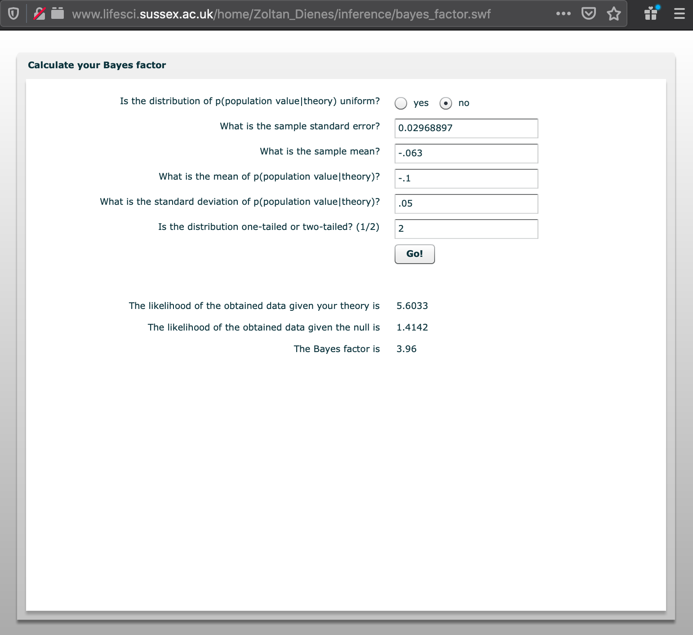

In what follows, we reanalyze the study by Yu et al. (2020).

# Set-up

```{r setup, message=F}
options(width = 130) # set output pagewidth
set.seed (190819)  # set seed 
library(bain); library(lavaan); library(tidyverse)  # load packages
```

We first recreate the covariance matrix reported by @yuMetaanalysisExplorePrivacy2020.

```{r}
vars <- c("pri_ris", "pri_con", "dis_int", "dis_beh")
cor_c <- c(1, .62, -.203, -.165, 1, -.159, -.063, 1, .487, 1)
cor_ma <- lav_matrix_vech_reverse(cor_c, diagonal = TRUE)
colnames(cor_ma) <- vars
rownames(cor_ma) <- vars
cor_ma
```

We then compute the harmonic mean given the sample sizes reported in the paper. 

```{r}
n_c <- c(9611, 5152, 19062, 20013, 8229, 5079) # harmonic mean for n
n_hm <- psych::harmonic.mean(n_c)
n_hm
```

# Reported Model

Referring to Problem 2, we rebuild the model reported in the paper.


```{r}
model_reported <- "
  pri_con ~~ pri_ris
  dis_int ~ pri_con + pri_ris
  dis_beh ~ pri_ris + dis_int
"
fit_reported <- sem(model_reported, sample.cov = cor_ma, sample.nobs = n_hm)
```

The model shows the following fit: 

```{r}
fit_indices <- c("chisq", "df", "pvalue", "cfi", "nfi", "rmsea", "srmr")
fitMeasures(fit_reported, fit_indices)
```

The results equal those reported in the paper (with the exception that in the paper RMSEA is falsely reported as .008). 

Note that there is one degree of freedom, because the path `pri_con` on `dis_beh` is not included.

We then look at the results of the structural model.

```{r}
summary(fit_reported, standardized = TRUE, header = FALSE)
```

The results resemble exactly those reported in the paper.

# Saturated Model

We now estimate the saturated model by adding `pri_con` as predictor for `dis_beh`. 


```{r}
model_saturated <- "
  pri_con ~~ pri_ris
  dis_int ~ pri_con + pri_ris
  dis_beh ~ pri_con + pri_ris + dis_int
"
fit_saturated <- sem(model_saturated, sample.cov = cor_ma, sample.nobs = n_hm)
```

The model shows the following fit: 

```{r}
fitMeasures(fit_saturated, fit_indices)
```

Because the model is satured and we have no degrees of freedom, we now get "perfect" fit. 

**The RMSEA equals 0, and not .368 as reported in the paper.**

We then look at the results of the structural model.

```{r}
summary(fit_saturated, standardized = TRUE, header = FALSE, ci = TRUE)
```

Interestingly, we even find a _positive_ relation between privacy concerns and disclosure behavior.

However, this finding shouldn't be surprising: Because privacy concern and privacy risks are strongly correlated (_r_ = `r cor_ma["pri_con", "pri_ris"]`), we have a situation typical of _multicollinearity._ That is, if strongly correlated predictors are included in the same model, confidence intervals increase, and oftentimes signs reverse (as is the case here). 

This isn't even necessary problematic, but reflects are more difficult to interpret model and less statistical power [see @vanhoveCollinearityIsnDisease2019].

# Support for Null Hypothesis
## Confidence Intervals

We first design a figure to illustrate how confidence intervals can be used to test support for the null hypothesis.

```{r warning=F, message=F}
# make table with data
d_plot <- tribble(
  ~name, ~type, ~Effect, ~ll, ~ul,
  "1. Accept null region hypothesis", "Decision Rule", NA, -.03, .03, 
  "2. Reject null region hypothesis", "Decision Rule", NA, -.15, -.09,
  "3. Reject positive effect hypothesis", "Decision Rule", NA, -.09, .03,
  "4. Suspend judgement", "Decision Rule", NA, -.08, .08,
  "Yu et al. (2020)", "Study", -.063, -.120, -.005,
  "Baruh et al. (2017)", "Study", -.13, -.18, -.07
) %>% 
  mutate(
    name = factor(name, levels = name),
    name = fct_rev(name),
    type = factor(type, levels = c("Decision Rule", "Study"))
         )

# design plot
plot <- ggplot(d_plot, aes(y = name)) +
  geom_vline(xintercept = 0, color = "darkgrey", linetype = "dashed") + 
  geom_vline(xintercept = -.05, color = "darkgrey") +
  geom_vline(xintercept = .05, color = "darkgrey") +
  geom_point(aes(Effect)) +
  geom_errorbarh(aes(xmin = ll, xmax = ul), height = .5) +
  facet_grid(rows = vars(type), scales = "free_y", space = "free") +
  theme(axis.title.y = element_blank())+
  labs(x = "Effect Size (r)",
       caption = "Smallest effect size of interest: r = -.05
                  Null region: r = -.05, .05")

ggsave("figures/figure_intervals.png", height = 3.5)
plot
```

## Bayes Factors

We now compare the likelihood of competing hypotheses using Bayes factors.

### Dienes' Bayes Factor

```{r}
source("fun_bayes_factor.R")  # load bayes factor function

# insert values from Yu et al. (2020)
sample_z <- -2.122
sample_r <- -.063
sample_se <- sample_r / sample_z  # see Dienes (2014, p. 6)
sample_r_ll <- sample_r - 1.96 * sample_se 
sample_r_ul <- sample_r + 1.96 * sample_se
sample_k <- 44
sample_sd <- sample_se * sqrt(sample_k)
```

We hypothesize that there is a small relation between concerns and information sharing. We compare the likelihood of this hypothesis, hence our theory, to the null hypothesis, in light of our data.

```{r}
Bf(se = sample_se, # note that this is an error in the script and should be "se" (instead of "sd"); if we insert se instead of sd, we obtain the exact same results as Dienes' online calculator at www.lifesci.sussex.ac.uk/home/Zoltan_Dienes/inference/bayes_factor.swf
   obtained = sample_r,
   uniform = 0,
   meanoftheory = -.1,
   sdtheory = .05,  # SD = M/2; see Dines (2014, p. 6)
   tail = 2)
```

The results show that our theory is about 4 times more likely than the null-hypothesis. This provides moderate support for our theory and speaks against the null hypothesis.

To test whether our formula is correct, we have entered the same information in Dienes' [Bayes Factor Calculator]("www.lifesci.sussex.ac.uk/home/Zoltan_Dienes/inference/bayes_factor.swf"). 



The results are exactly the same, which shows that our function is correct.

### Van Lissa's BAIN

We can also compute the Bayes factor for informed hypotheses using Van Lessa's BAIN package. 

In what follows, we compare H1: _r_ < -.05 (no privacy paradox) with its complement H2: _r_ ≥ -.05 (privacy paradox).

```{r}
model_bf <- "
  dis_beh ~ pri_con
"
fit_bf <- sem(model_bf, sample.cov = cor_ma, sample.nobs = n_hm)

hypothesis_1 <- "
  dis_beh~pri_con < -.05;
"
bain(fit_bf, hypothesis_1)
```

H1 (no privacy paradox) is more than 7-times more likely than the H2 (privacy paradox) (see "BF.c").

# Literature


