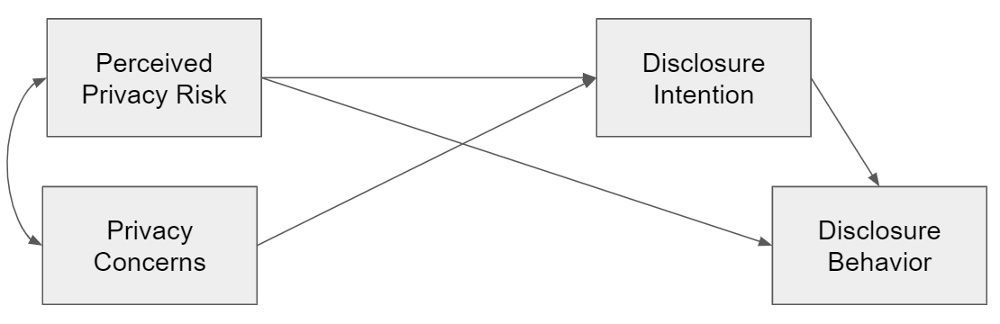
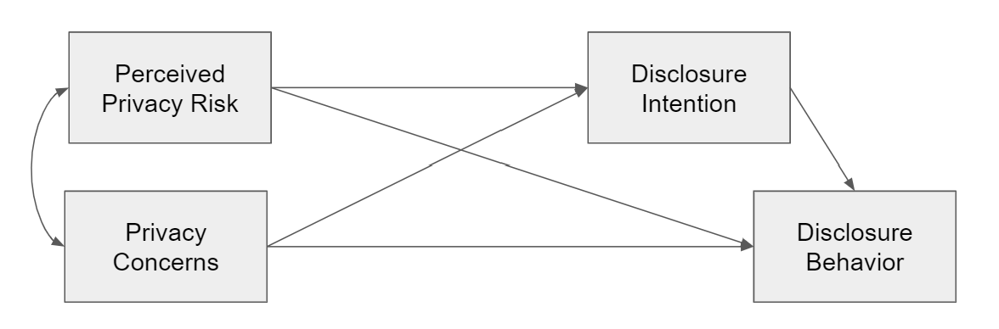

In what follows, we reanalyze the study by Yu et al. (2020).

# Set-up

We first recreate the covariance matrix reported by @yuMetaanalysisExplorePrivacy2020.

```{r}
options(width = 130) # 
vars <- c("pri_ris", "pri_con", "dis_int", "dis_beh")
cor_c <- c(1, .62, -.203, -.165, 1, -.159, -.063, 1, .487, 1)
cor_ma <- lavaan::lav_matrix_vech_reverse(cor_c, diagonal = TRUE)
colnames(cor_ma) <- vars
rownames(cor_ma) <- vars
cor_ma
```

We then compute the harmonic mean given the sample sizes reported in the paper. 

```{r}
n_c <- c(9611, 5152, 19062, 20013, 8229, 5079) # harmonic mean for n
n_hm <- psych::harmonic.mean(n_c)
n_hm
```

# Reported Model

Referring to Problem 2, we rebuild the model reported in the paper.



```{r}
model_reported <- "
  pri_con ~~ pri_ris
  dis_int ~ pri_con + pri_ris
  dis_beh ~ pri_ris + dis_int
"
fit_reported <- lavaan::sem(model_reported, sample.cov = cor_ma, sample.nobs = n_hm)
```

The model shows the following fit: 

```{r}
fit_indices <- c("chisq", "df", "pvalue", "cfi", "nfi", "rmsea", "srmr")
lavaan::fitMeasures(fit_reported, fit_indices)
```

The results equal those reported in the paper (with the exception that in the paper RMSEA is falsely reported as .008). 

Note that there is one degree of freedom, because the path `pri_con` on `dis_beh` is not included.

We then look at the results of the structural model.

```{r}
lavaan::summary(fit_reported, standardized = TRUE, header = FALSE)
```

The results resemble exactly those reported in the paper.

# Saturated Model

We now estimate the saturated model by adding `pri_con` as predictor for `dis_beh`. 



```{r}
model_saturated <- "
  pri_con ~~ pri_ris
  dis_int ~ pri_con + pri_ris
  dis_beh ~ pri_con + pri_ris + dis_int
"
fit_saturated <- lavaan::sem(model_saturated, sample.cov = cor_ma, sample.nobs = n_hm)
```

The model shows the following fit: 

```{r}
lavaan::fitMeasures(fit_saturated, fit_indices)
```

Because the model is satured and we have no degrees of freedom, we now get "perfect" fit. The RMSEA equals 0, and not .368 as reported in the paper.

We then look at the results of the structural model.

```{r}
lavaan::summary(fit_saturated, standardized = TRUE, header = FALSE, ci = TRUE)
```

We even find a _positive_ relation between privacy concerns and disclosure behavior. 

However, this finding shouldn't be surprising: Because privacy concern and privacy risks are strongly correlated (_r_ = `r cor_ma["pri_con", "pri_ris"]`), we have a situation typical of _multicollinearity._ That is, if strongly correlated predictors are included in the same model, confidence intervals increase, and oftentimes signs reverse (as is the case here). 

This isn't even necessary problematic, but reflects are more difficult to interpret model and less statistical power [see @vanhoveCollinearityIsnDisease2019].

